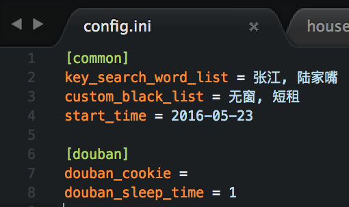
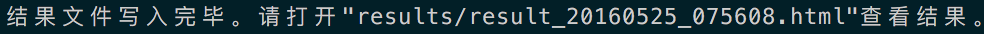
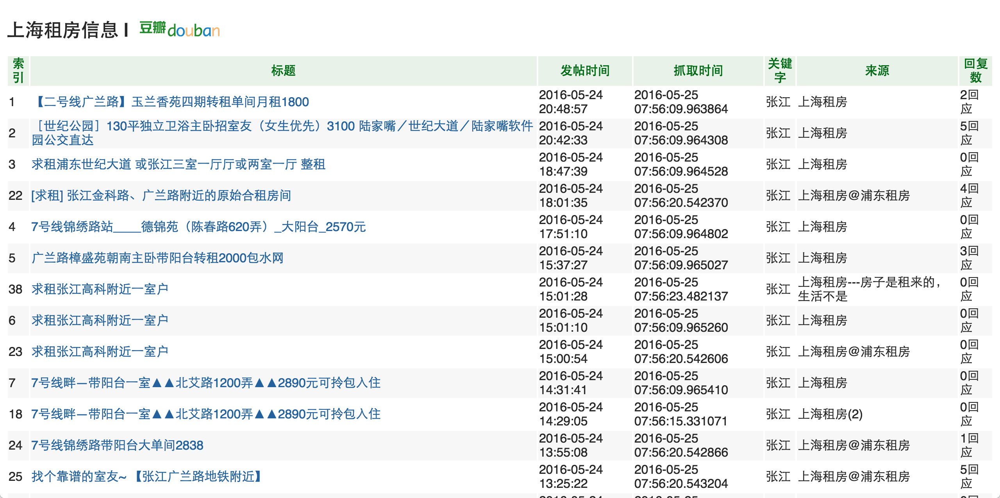
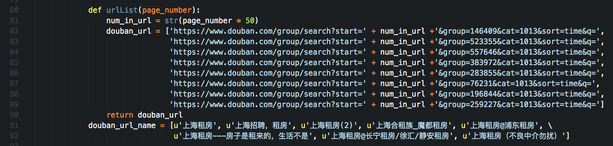

# house-renting-spider
豆瓣小组上海租房爬虫
  
## System Requirements:

- Python 2.7.10  
- pip
- (Optional) [virtualenv](https://virtualenv.pypa.io/en/latest/)  

## To start

```bash
# Clone the repo
$ git clone https://github.com/PeggyZWY/house-renting-spider
$ cd house-renting-spider

# Install requirements
$ pip install -r requirements.txt  

# Modify config.ini
$ vim config.ini
```   
  
  
在**config.ini**里配置并保存：  
1. `key_search_word_list`为想要搜索的关键词。如果有多个关键词，请用**英文**逗号`,`隔开  
2. `custom_black_list`为拒绝的关键词黑名单。同样如果有多个关键词，请用**英文**逗号`,`隔开  
3. `start_time`为要搜索在这个时间之后的信息。请用`2016-05-01`这种格式表示日期  
4. `[douban]`这个option下的`douban_cookie`和`douban_sleep_time`不需要改变。程序里会自动设置cookie；`douban_sleep_time`设为1秒钟比较合适，防止豆瓣反爬虫封号  

比如：  
  
  
配置好之后继续在终端输入：  
  
```bash  
$ python houseRentingSpider.py  
```  
  
然后就等爬虫爬呀爬。  
  
结束之后，命令行有提示。比如：  
  
  
根据提示打开此HTML文件后会出现结果。比如（截图仅截取部分结果）：  
  
  
配色是根据豆瓣来的嘿嘿:)  
  
## Others  
在`houseRentingSpider.py`里，现在设置了如下小组。    

    

`douban_url`这个数组里URL的参数中group的值以及`douban_url_name`数组里的小组名要一一对应。  
  
也就是说，只要你是在**豆瓣小组**里对**关键字**进行爬取，在这里设置小组，在`config.ini`设置关键词，就可以定制出自己的爬虫。  

  
